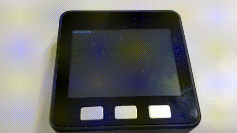

# m5stack-gitlab-ci-notifier
M5Stack study - gitlab.com CI status checker

## Usage
1) Set up M5Stack development environment.
2) Configure `config.json`, place it to SD card in M5Stack.
3) Run scketch `m5stack-gitlab-ci-notifier.ino`.

## Demo

## TODO
- [ ] push button to retry
- [ ] paused icon
